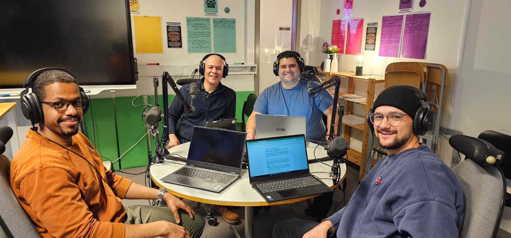

# Assessment and reflection

This page reproduces the self-assessment, peer review, and team assessment sections from the Individual Project Portfolio 2 submission, presented verbatim for transparency and course evaluation purposes.

---

## Self-assessment

> **Self-Assessment for IPP part 2**  
>  
> To conclude this second version of the portfolio, I consider that my contribution has been solid.  
> I have established and improved the foundation and the pipeline for acquiring process data, provided support to my teammates, suggested the structure for the project Git repository, participated in the tests for communication, debugging and deployment on Hololens2, and fulfilled the responsibilities of the project leader.  
> As a team, we have successfully overcome several challenges and implemented a pipeline that shows real data in a Unity application deployed on the Hololens 2.
>
---

## Reflective self-assessment

### What went well and why
The backend data integration progressed smoothly because I focused early on stabilizing the data pipeline and defining clear API boundaries. This reduced uncertainty for the rest of the team and enabled parallel development across system components.

### What was challenging and why
The main challenge was integrating heterogeneous technologies, including PLCs, OPC UA, Node-RED, Unity, and the HoloLens. Ensuring consistent and reliable data flow across these layers required careful debugging and coordination.

### Skills developed
I developed stronger skills in industrial data integration, REST API design, and system-level debugging. I also improved my ability to communicate technical constraints and design decisions to teammates working on different parts of the system.

### What I would do differently in the future
In future projects, I would define interface contracts and data schemas earlier and introduce automated integration testing to identify issues sooner.

### What I learned from Scrum and teamwork
Working in sprints reinforced the importance of clear task ownership and frequent communication. Scrum practices helped structure progress, while teamwork across disciplines highlighted the value of aligning individual contributions with shared project goals.

---

## Peer review and group feedback

| Teammate | Feedback (verbatim summary) | My reflective response |
|---------|-----------------------------|------------------------|
| Leon | Great ownership of the Node-RED part and pushing the group forward | I agree with this feedback. I deliberately took ownership of the Node-RED and data pipeline layer to stabilize industrial data acquisition early. By pushing progress on this backend layer, I aimed to reduce integration risk and ensure that Unity and XR development could proceed without being blocked by data availability. |
| Hamza | Organized problem solver, responsible for backend data access and real-time communication, contributed to Unity and UI development | I agree with this feedback. I was primarily responsible for backend data access and real-time communication between PLCs, Node-RED, and Unity. While the Unity UI implementation was mainly handled by Hamza, I contributed through integration, testing, and debugging to ensure that backend data was correctly consumed by the application. |
| Jorge | Key enabler of the interface between the system and XR deployment, strong experience with PLCs and APIs | I agree with this feedback. I focused on designing clear and stable interfaces between the industrial systems and the XR application. I applied prior experience with PLCs and APIs to define appropriate abstraction levels and minimize coupling between the industrial layer and Unity logic. |

---

## Personal assessment of the team

> **Leon**  
> Pushed and led the image recognition feature of the application and contributed to keeping the project implementation simple but functional.
>
> **Hamza**  
> Hard worker, built from cero the Unity app, explained to the team the details on how the components interact with the scripts and how to deploy to the lenses.  
> Tied together all the pieces into the application.
>
> **Jorge**  
> Good overview of the tasks, keeping track of missing details, presentation slides and playing a key role organizing and hosting the podcast.
>

---

## Team collaboration and dissemination

*Participating in the project podcast, discussing technical and design aspects of the XR system.*

*Project team during podcast recording and technical discussion as part of the XR project.*

