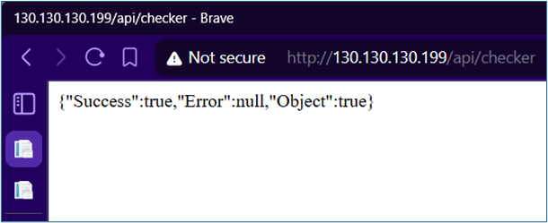
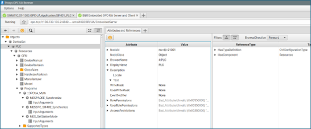
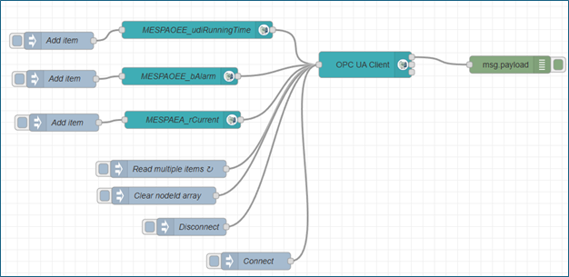
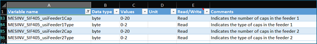
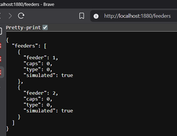
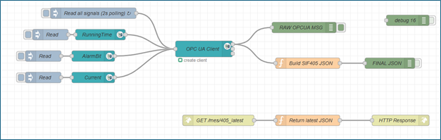

# Node RED and OPC UA integration

## Scope of contribution

This page documents my primary technical contribution to the project: establishing reliable industrial connectivity and transforming raw PLC signals into structured REST APIs consumable by Unity.

My responsibilities covered signal discovery, Node RED flow design, REST API implementation, and station level data aggregation for SIF 402 and SIF 405.

## Connectivity validation using the SIF API

Before implementing OPC UA flows in Node RED, connectivity to the SIF system was validated using the SIF API checker endpoint. This provided a fast confirmation that the system was reachable and operational.



Figure 2 – Response obtained from the GET request to the checker endpoint. Success true confirms that the API is working

## Node RED environment setup

Node RED was installed and configured with OPC UA client nodes to enable communication with Siemens PLCs.


Figure 1 – Initial Node RED setup showing OPC UA nodes available

This setup was tested both on Windows and in containerized environments. Early tests highlighted networking considerations when using Docker with WSL2, particularly for OPC UA communication.

## OPC UA signal discovery

Before implementing Node RED flows, PLC communication was validated using an OPC UA browser to inspect available signals, browse paths, and data types.

SIF 402 discovery example:



Figure 4 – OPC UA browser view showing available signals for station SIF 402

SIF 405 discovery example:


Figure 19 – OPC UA browser view showing feeder related signals for station SIF 405

## Reading PLC data via OPC UA in Node RED

Initial Node RED flows focused on reading a single PLC signal to validate connectivity and data integrity.


Figure 6 – Node RED flow reading a single PLC signal through OPC UA

Once validated, the flow was extended to read multiple signals in parallel.



Figure 7 – Node RED flow scaled to read multiple PLC signals

## REST API implementation

To expose PLC data to the Unity application, REST endpoints were implemented using Node RED HTTP In and HTTP Out nodes.


Figure 8 – Implementation of a REST API endpoint returning the latest PLC data

Flow context was used inside a function node to retain and then return, the latest snapshot of each signal, ensuring that API calls returned a consistent state.

=== "Store latest value"
    ```javascript
    flow.set("blue_lastSignal", msg.payload);
    return msg;
    ```

=== "Return latest value"
    ```javascript
    const data = flow.get("blue_lastSignal");
    if (!data) {
    msg.payload = { error: "No data available yet" };
    msg.statusCode = 503;
    return msg;
    }

    msg.payload = data;
    msg.headers = { "Content-Type": "application/json" };
    return msg;
    ```

This REST endpoint returns the latest snapshot of the PLC value in JSON format.

## Station level data aggregation for SIF 402

Multiple SIF 402 signals were aggregated into a single JSON object to minimize API calls from Unity. The packed payload included operational signals and hopper state.


Figure 15 – Node RED flow aggregating operational and hopper data for station SIF 402

The latest raw data from the PLC is captured and transformed into a JSON format through the following code.

=== "Extracts OPC UA browser name"
    ```javascript
    let browseName = msg.topic?.browseName;
    let value = msg.payload;
    ```

=== "Loads latest values"
    ```javascript
    let state = flow.get("402_state") || {
    station: {
        id: "SIF-402",
        status: "Unknown",
        recipe: "StandardMix_v2.3",
        timestamp: "",
        runningTime: 0,
        current: 0,
        hopper1: {
            present: true,
            minPellets: true
        },
        hopper2: {
            present: true,
            minPellets: true
        },
        hopper3: {
            present: true,
            minPellets: true
        }
    },
    alarms: []
    };
    ```
=== "Updates new values"
    ```javascript
    switch (browseName) {

    case "RunningTime":
        state.station.runningTime = value;
        break;

    case "AlarmBit":
        if (value === true) {
            state.station.status = "Alarm";
            state.alarms = [
                {
                    id: "station_alarm",
                    severity: "warning",
                    message: "Station is in Alarm !",
                    timestamp: new Date().toISOString()
                }
            ];
        } else {
            state.station.status = "Running";
            state.alarms = [
                {
                    id: "station_alarm",
                    severity: "info",
                    message: "Station has none alarms",
                    timestamp: new Date().toISOString()
                }
            ];
        }
        break;

    case "Current":
        state.station.current = value;
        break;
    
    case "Hopper1_present":
        state.station.hopper1.present = value;
        break;

    case "Hopper1_Min_pellets":
        state.station.hopper1.minPellets = value;
        break;
    
    case "Hopper2_present":
        state.station.hopper2.present = value;
        break;

    case "Hopper2_Min_pellets":
        state.station.hopper2.minPellets = value;
        break;

    case "Hopper3_present":
        state.station.hopper3.present = value;
        break;

    case "Hopper3_Min_pellets":
        state.station.hopper3.minPellets = value;
        break;
    }
    ```

=== "Saves values in flow context"
    ```javascript
    state.station.timestamp = new Date().toISOString();

    flow.set("402_state", state);

    msg.payload = state;
    return msg;
    ```

The resulting API response exposed all relevant station data in a single request.


Figure 16 – REST API response containing aggregated station data for SIF 402

## Data identification and extraction for SIF 405 feeders

For SIF 405, the first step was to identify variables related to the number and type of caps in each feeder by filtering the available signals list.



Figure 18 – List of variables filtered for station SIF 405

A Node RED flow was then implemented to read these signals via OPC UA and expose them through a REST endpoint, while also including a simulation path for development and testing.


Figure 20 – Node RED flow to extract SIF 405 feeder data. The upper section reads PLC data and the lower section supports simulation

Data is extracted, validated and then transformed into a JSON format through the following set of code, if simulation mode is enabled it returns mock up values.

=== "Extracts OPC UA data Function node"
    ```javascript
    // Normalize key from browseName
    let keyObj = msg.topic || {};
    let key = "";

    if (typeof keyObj === "object") {
        key = keyObj.browseName || keyObj.nodeId || JSON.stringify(keyObj);
    } else {
        key = String(keyObj);
    }

    const val = msg.payload;

    // Ignore weird/unexpected messages
    if (val === undefined || val === null) return null;

    // Helper: store real PLC values unless simulation is active
    function storeReal(name, value) {
        const simFlag = flow.get(name + "_sim");
        if (simFlag && simFlag.active) return;     // simulation active → ignore PLC
        flow.set(name, { value: value, simulated: false });
    }

    // Route based on browseName
    if (key === "Feeder1Cap") storeReal("feeder1_cap", val);
    if (key === "Feeder1Type") storeReal("feeder1_type", val);
    if (key === "Feeder2Cap") storeReal("feeder2_cap", val);
    if (key === "Feeder2Type") storeReal("feeder2_type", val);

    return null;
    ```

=== "Updates values"
    ```javascript
    return {
    feeder1_cap: flow.get("feeder1_cap"),
    feeder1_cap_sim: flow.get("feeder1_cap_sim"),
    feeder1_type: flow.get("feeder1_type"),
    feeder1_type_sim: flow.get("feeder1_type_sim"),
    feeder2_cap: flow.get("feeder2_cap"),
    feeder2_cap_sim: flow.get("feeder2_cap_sim"),
    feeder2_type: flow.get("feeder2_type"),
    feeder2_type_sim: flow.get("feeder2_type_sim")
    };
    ```


=== "Builds JSON response for both feeders"
    ```javascript
    const f1c = flow.get('feeder1_cap');
    const f1t = flow.get('feeder1_type');
    const f2c = flow.get('feeder2_cap');
    const f2t = flow.get('feeder2_type');

    // fallback defaults if missing
    function safe(val) {
        return val ? val : {value:0, simulated:true};
    }

    const feeder1 = {
        feeder: 1,
        caps: safe(f1c).value,
        type: safe(f1t).value,
        simulated: safe(f1c).simulated || safe(f1t).simulated
    };

    const feeder2 = {
        feeder: 2,
        caps: safe(f2c).value,
        type: safe(f2t).value,
        simulated: safe(f2c).simulated || safe(f2t).simulated
    };

    msg.payload = {
        feeders: [ feeder1, feeder2 ]
    };

    return msg;
    ```
    
The resulting feeder endpoint response is shown here:



Figure 21 – REST API response for SIF 405 feeders data

## Reuse of operational signals for SIF 405

The operational signals already implemented for SIF 402, running time, current, and alarm state, were replicated for SIF 405 by reusing the same logic and changing the PLC endpoint, while removing hopper specific signals.



Figure 23 – Node RED flow implemented to get operational data from SIF 405 using the same structure as for SIF 402

The code is reused and slightly adapted as well.


=== "Extracts OPC UA browser name"
    ```javascript
    let browseName = msg.topic?.browseName;
    let value = msg.payload;
    ```

=== "Loads latest values"
    ```javascript
    let state = flow.get("405_state") || {
    station: {
        id: "SIF-405",
        status: "Unknown",
        recipe: "StandardMix_v2.3",
        timestamp: "",
        runningTime: 0,
        current: 0
    },
    alarms: []
    };
    ```

=== "Updates new values"
    ```javascript
    switch (browseName) {

    case "RunningTime":
        state.station.runningTime = value;
        break;

    case "AlarmBit":
        if (value === true) {
            state.station.status = "Alarm";
            state.alarms = [
                {
                    id: "station_alarm",
                    severity: "warning",
                    message: "Station is in Alarm !",
                    timestamp: new Date().toISOString()
                }
            ];
        } else {
            state.station.status = "Running";
            state.alarms = [
                {
                    id: "station_alarm",
                    severity: "info",
                    message: "Station has none alarms",
                    timestamp: new Date().toISOString()
                }
            ];
        }
        break;

    case "Current":
        state.station.current = value;
        break;    
    }
    ```

=== "Saves values in flow context"
    ```javascript
    state.station.timestamp = new Date().toISOString();

    flow.set("405_state", state);

    msg.payload = state;
    return msg;
    ```


## Outcome

The Node RED and OPC UA layer achieved:

• Stable PLC communication for SIF 402 and SIF 405  
• Clear separation between industrial and application layers  
• Station level data aggregation to reduce Unity API calls  
• REST APIs suitable for XR consumption  
• Reusable flow patterns across stations

## Engineering challenges and lessons learned

• OPC UA discovery was non-trivial due to deeply nested address spaces and inconsistent signal naming  
• Early validation with an OPC UA browser was essential to avoid incorrect node configuration  
• Containerized Node-RED setups introduced networking issues under WSL2, reinforcing the need to understand host–container communication  
• Aggregating signals into station-level JSON objects significantly reduced API complexity and coupling with Unity  
• Flow context management was critical to ensure REST endpoints returned consistent snapshots rather than transient values
