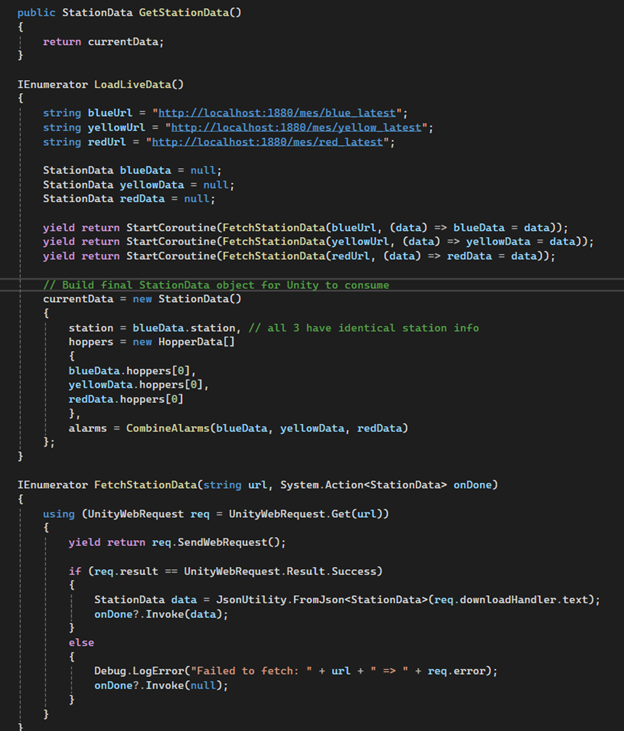
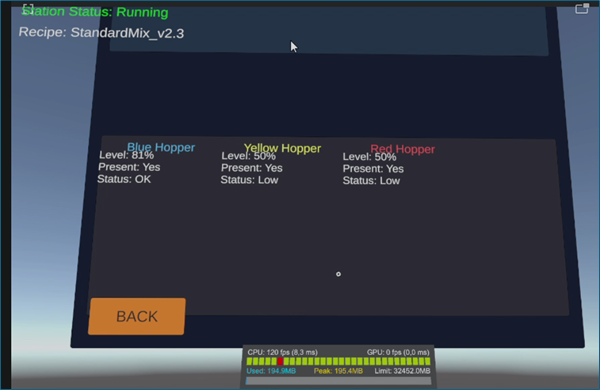
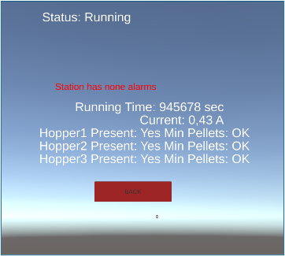
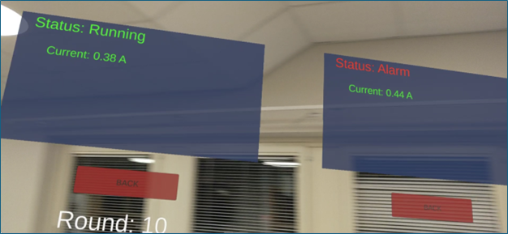

# Unity and HoloLens integration

## Scope of contribution

The Unity application and XR interaction logic were developed collaboratively as a team effort.  
My contribution focused on **data integration**, ensuring that industrial data exposed through Node-RED REST APIs could be reliably consumed, tested, and visualized in Unity and Microsoft HoloLens 2.

This page documents that integration perspective.

---

## Data consumption in Unity

Unity scripts were implemented to fetch station-level data from the REST APIs and deserialize the returned JSON into application data structures.

Figure 12 – Example of a C# script used in Unity to request and process station data from the Node-RED REST API

From an integration standpoint, the key requirement was that the API responses remained stable and self-contained, allowing Unity to remain decoupled from PLC-specific details.

---

## Simulation-first integration strategy

To enable development and testing without continuous access to the PLC network, simulated OPC UA signals were introduced at the Node-RED layer.

This allowed:

• Validation of API structure  
• Development of Unity logic independently of PLC availability  
• Early verification of XR visualization behavior  

The Unity application retrieving simulated data is shown below.

Figure 13 – Unity panel displaying simulated station data retrieved through the REST API

---

## Transition to live PLC data

Once connectivity and data formatting were validated, simulated signals were replaced with live PLC data without modifying the Unity logic.

Figure 17 – Unity application displaying live operational data from station SIF402

This confirmed that the station-level API abstraction successfully isolated the XR application from changes in the data source.

---

## Deployment and testing on HoloLens 2

The final system was deployed and tested on Microsoft HoloLens 2.  
My involvement focused on:

• Verifying network accessibility of REST endpoints  
• Assisting with integration debugging  
• Validating correct live data visualization on device  

A deployed example showing live feeder data is shown here.

Figure 22 – HoloLens view showing live feeder counts for station SIF405

The application also supported simultaneous visualization of multiple stations.

Figure 24 – HoloLens view showing simultaneous visualization of stations SIF402 and SIF405

*Testing the XR application with live industrial data on Microsoft HoloLens 2.*

---

## Outcome

From an integration perspective, the Unity and XR layer demonstrated that:

• REST APIs were stable and suitable for XR consumption  
• Simulation enabled parallel development and testing  
• Unity logic remained decoupled from PLC structure  
• Live industrial data could be reliably visualized on HoloLens 2  

This validated the end-to-end pipeline from industrial equipment to XR visualization.

## Engineering challenges and lessons learned

• Direct dependency on live PLC data would have blocked Unity development during early stages  
• A simulation-first strategy enabled parallel development and early validation of XR behavior  
• Stable and self-contained REST APIs allowed Unity logic to remain unchanged when switching from simulated to live data  
• Network accessibility and firewall configuration became practical deployment constraints during HoloLens testing

