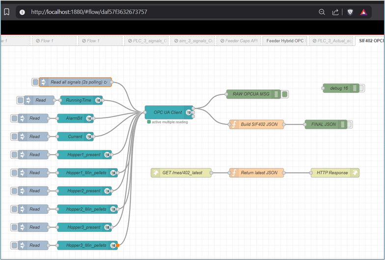

# XR industrial data pipeline

## Project context

This project demonstrates an end-to-end industrial data pipeline where live signals from Siemens PLCs are acquired, processed, and visualized in an extended reality application running on Microsoft HoloLens 2.

The work was developed as a team project within the HT2025 course. This page focuses on the overall system architecture and on my individual contributions to the industrial data pipeline enabling the XR application.

## System overview

The implemented system consists of the following layers:

• Siemens PLCs providing operational and inventory data  
• OPC UA for industrial communication  
• Node-RED as an intermediate processing and API layer  
• Unity as the application logic layer  
• Microsoft HoloLens 2 as the visualization device  

The architecture was designed to keep a clear separation between industrial systems and the XR application, enabling testing, simulation, and reuse.

## My role in the pipeline

My responsibilities focused on the industrial and data engineering layers of the system:

• Level 1 connectivity validation  
• OPC UA signal discovery and testing  
• Node-RED flow design and implementation  
• REST API design for Unity consumption  
• Aggregation of station-level data  
• Support during integration and XR deployment testing  

## Station-level data abstraction

A key design decision was to expose **station-level APIs** rather than raw signal-level endpoints.

For station SIF402, operational signals and hopper states were aggregated into a single JSON object.

Figure 15 – Node-RED flow aggregating operational and hopper data for station SIF402

The resulting API response exposed all relevant station information in a single request.

Figure 16 – REST API response containing aggregated station data for SIF402

This abstraction significantly simplified the XR application logic and reduced coupling between Unity and the PLC structure.

## Multi-station support

The same architectural pattern was applied to additional stations.

For station SIF405, feeder-related data was extracted and exposed through a dedicated REST endpoint while reusing the same structural principles.

Figure 20 – Node-RED flow extracting feeder data for station SIF405, including simulation support

This validated that the pipeline could scale to multiple stations without redesign.

## XR visualization and verification

Before connecting to live PLC data, simulated signals were used to verify the XR application behavior.

Figure 13 – Unity panel displaying simulated station data retrieved through the REST API

Once connectivity was validated, simulated signals were replaced with live PLC data.

Figure 17 – Unity application displaying live operational data from station SIF402

## HoloLens 2 deployment results

The final system was deployed and tested on Microsoft HoloLens 2, visualizing live industrial data in an XR environment.

Figure 22 – HoloLens view showing live feeder counts for station SIF405

The application also supported simultaneous visualization of multiple stations.

Figure 24 – HoloLens view showing simultaneous visualization of SIF402 and SIF405

## Outcome

The implemented XR industrial data pipeline demonstrated:

• Stable acquisition of live PLC data  
• Clear separation between industrial and XR layers  
• Station-level data abstraction suitable for XR  
• Scalability to multiple stations  
• Successful deployment and testing on HoloLens 2  

This page captures the system-level perspective of the project, while detailed implementation aspects are documented in the corresponding technical pages.

## Engineering challenges and lessons learned

• Exposing raw PLC signals directly to XR applications creates tight coupling and poor scalability  
• Introducing a station-level abstraction simplified the XR logic and enabled multi-station support  
• Simulation paths were necessary to decouple development from PLC availability  
• Designing the pipeline with clear layer separation made it easier to extend the system to additional stations without redesign
